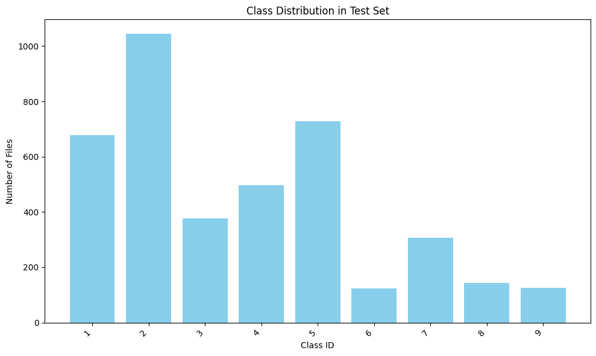

# Vehicle Detection

Automatic detection and classification of vehicles in road images using computer
vision and deep learning.

## Project Overview

This project implements a neural network-based system for vehicle detection and
classification. The system:

- **Localizes objects** using bounding boxes
- **Classifies vehicles** by body type (coupe, sedan, truck, SUV, hatchback,
  convertible, minivan, van, wagon)
- **Outputs standardized JSON** for analytics and monitoring

### I/O Format

**Input:**

- RGB images (JPG/PNG)
- Arbitrary size (normalized to 640×640)

**Output:**

```json
{
  "detections": [
    {
      "bbox": [100, 150, 300, 400],
      "score": 0.95,
      "class_id": 1,
      "class_name": "sedan"
    }
  ]
}
```

### Dataset

#### Stanford Cars Dataset

##### Overview

- 16,185 images
- 196 original classes → generalized to 9 body types
- Split: 50% train / 25% val / 25% test

##### Class Distribution (9 body types)

| Train                                 | Validation                        | Test                                |
| ------------------------------------- | --------------------------------- | ----------------------------------- |
|  |  |  |

### Model Architecture

**Faster R-CNN with ResNet50-FPN backbone:**

- Two-stage detection (region proposals + classification)
- AdamW optimizer with Cosine Annealing scheduler (with warmup)

### Metrics

- **mAP@0.5:0.95** — primary metric (COCO-style, averaged over IoU thresholds)
- **mAP@0.5** — lenient metric (PASCAL VOC-style)
- **mAP@0.75** — strict localization
- **Per-class AP** — performance on each (imbalanced) body type
- **mAR@100** — recall (missed-detection check)

## Setup

### Requirements

- Python 3.12+
- uv package manager

### Installation

```bash
# Clone repository
git clone https://github.com/iamivan11/vehicle-detection.git
cd vehicle-detection

# Install uv (if not installed)
curl -LsSf https://astral.sh/uv/install.sh | sh

# Create environment and install dependencies
uv venv
source .venv/bin/activate  # Linux/Mac
#.venv\Scripts\activate  # Windows

uv sync

# Setup pre-commit hooks
pre-commit install
pre-commit run -a
```

## Train

### Start Training

```bash
uv run python -m vehicle_detection.commands train
```

### Start Custom Training

```bash
# Adjust hyperparameters
uv run python -m vehicle_detection.commands train \
    --batch_size=8 \
    --max_epochs=5 \
    --precision=32 \
    --accelerator=gpu \
    --num_workers=2 \
    --tracking_uri=http://127.0.0.1:8080
```

### Resume Training

Checkpoints are saved to `checkpoints/` and versioned with DVC. To continue a
previous run (restores model weights, optimizer, and LR scheduler state):

```bash
# Pull checkpoints from the DVC remote first (e.g. on your machine)
dvc pull

uv run python -m vehicle_detection.commands train \
    --resume_from=checkpoints/last.ckpt
```

Keep the training config identical to the original run (`max_epochs`, `lr`,
`batch_size`) so the cosine LR schedule continues correctly.

### Monitoring

```bash
# Launch MLflow UI (in separate terminal)
mlflow ui --host 127.0.0.1 --port 8080
```

Open <http://127.0.0.1:8080> in browser to view training metrics.

## Inference

```bash
# Single image
uv run python -m vehicle_detection.commands infer \
    --image path/to/image.jpg \
    --checkpoint checkpoints/best.ckpt

# Batch inference
uv run python -m vehicle_detection.commands infer \
    --image-dir path/to/images/ \
    --output-dir results/
```

## Project Structure

```
vehicle-detection/
├── .dvc/                     # DVC configuration
├── assets/                   # Dataset/EDA plots
├── configs/                  # Hydra configs
│   ├── config.yaml           # Main config
│   ├── model/                # Model configs
│   ├── train/                # Training configs
│   └── data/                 # Data configs
├── vehicle_detection/        # Main package
│   ├── data/                 # Data loading
│   │   ├── dataset.py        # Dataset and DataModule
│   │   └── download.py       # Data download utilities
│   ├── models/               # Model definitions
│   │   └── detector.py       # Lightning Module
│   ├── train.py              # Training script
│   ├── infer.py              # Inference script
│   └── commands.py           # CLI entry point
├── .pre-commit-config.yaml
├── pyproject.toml
├── uv.lock
└── README.md
```

## Tech Stack

The stack favors reproducibility and minimal boilerplate — each concern
(training, configuration, versioning, code quality) handled by a single fast,
opinionated tool.

| Layer                   | Choice                                 | Why this over alternatives                                                                 |
| ----------------------- | -------------------------------------- | ------------------------------------------------------------------------------------------ |
| Training loop           | **PyTorch Lightning**                  | Removes train-loop boilerplate; free multi-GPU, mixed precision, checkpointing             |
| Augmentation            | **Albumentations**                     | OpenCV-fast and transforms bounding boxes in sync with images (vs torchvision transforms)  |
| Config                  | **Hydra**                              | Composable YAML groups + CLI overrides → swap dataset/model in one flag (vs argparse)      |
| CLI                     | **Fire**                               | Zero-boilerplate CLI straight from function signatures                                     |
| Data & model versioning | **DVC** (Google Drive remote)          | Git-tracked pointers tie datasets and checkpoints to code commits; ML-aware unlike git-lfs |
| Experiment tracking     | **MLflow**                             | Open-source, local-first params/metrics/model registry — no vendor lock-in (vs W&B)        |
| Env & packaging         | **uv**                                 | Rust-fast installs with a real lockfile (vs pip/poetry)                                    |
| Lint & format           | **Ruff**                               | One Rust tool replaces flake8 + black + isort, near-instant                                |
| Pre-commit hooks        | **pre-commit** (+ prettier, codespell) | Auto-enforces formatting, typo and large-file checks before every commit                   |

## Development

### Code Quality

```bash
# Run all checks
pre-commit run -a

# Format code
ruff format .

# Lint code
ruff check . --fix
```
